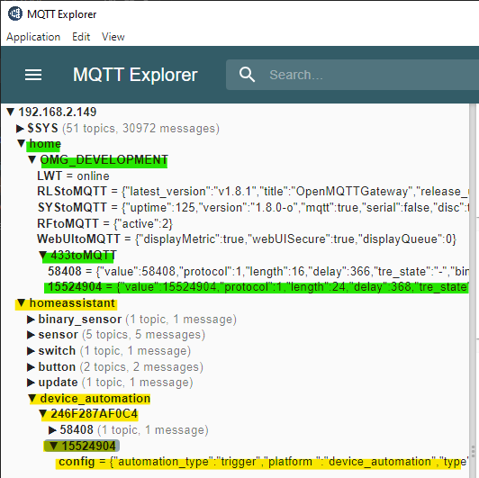
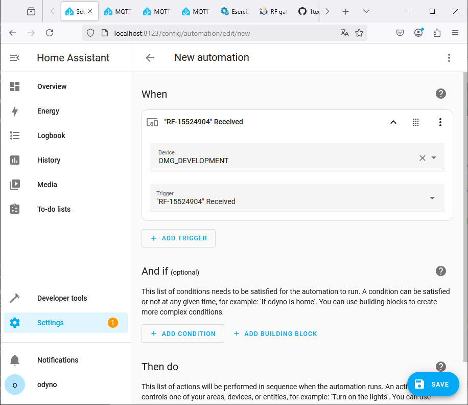
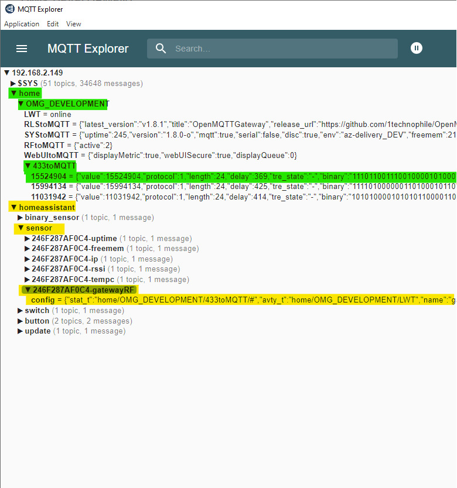
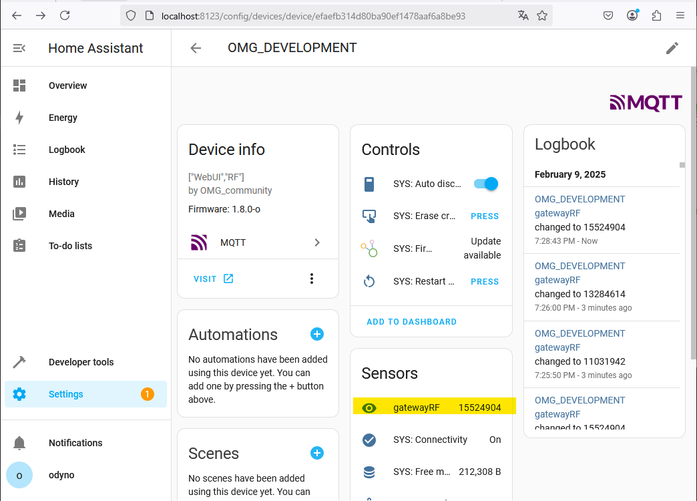

# Integrate Home Assistant

Home Assistant provide the [MQTT integration](https://www.home-assistant.io/integrations/mqtt/) and through this integration it is possible to exploit and manage the messages published by OpenMQTTGateway.

Once this integration on home assistant is configured with the same MQTT broker, it is possible to create devices manually or through the autodiscovery function.


## Automatic integration with Auto discovery 

From Home Assistant site 

> The discovery of MQTT devices will enable one to use MQTT devices with only minimal configuration effort on the side of Home Assistant. The configuration is done on the device itself and the topic used by the device.

On OpenMQTTGateway the Home Assistant discovery is enabled by default on all binaries and platformio configurations. Here are a few tips for activating discovery on Home Assistant, but for detailed configuration please refer to the Home Assistant website. 

Enable discovery on your MQTT integration in HASS (activated per default).


The gateway will need an MQTT username and password, you have to create a new user (recommended) into Home Assistant->Configuration->Users (available in admin mode) or use an existing username/pwd combination (not recommended). This user doesn't need to be an administrator.


::: warning Note
The max size of the username and password is 64 characters.
:::

OMG will use the auto discovery functionality of home assistant to create gateway and sensors into your HASS instance automatically.


::: tip INFO
The Bluetooth and the RTL_433 gateway will automatically create devices and entities, the RF gateway will create DeviceTrigger.
The OpenMQTTGateway will also be available as a device to monitor its parameters and control it. The sensors (DHT for example) and actuators (relays) are attached to the gateway.

On first and subsequent startups, auto discovery will start. If you want to prevent this from happening, be sure to manually turn off auto discovery, either by using the UI in Home Assistant, or by publishing to the home/<gatewayname>/commands/MQTTtoSYS/config topic.
30 minutes after its activation the auto discovery will be automatically deactivated, you can reactivate it from the gateway controls. 
Some devices may require a button push or motion/contact event to trigger a message and generate the auto discovery.
:::

### RTL_433 auto discovery specificity

Even if the RTL_433 gateway will create automatically the devices and entities, you may lose the link to them when you change the batteries. This is proper to the RF devices. In this case new device and entities will be created. You may bypass this by creating entities through manual configuration that filter following the device model and other parameters and don't take into account the id.
Example:
```yaml
mqtt:
  sensor:
    - state_topic: "+/+/RTL_433toMQTT/WS2032/+"
```
instead of
```yaml
mqtt:
  sensor:
    - state_topic: "+/+/RTL_433toMQTT/WS2032/47998"
```
Note also that the sensor may leverage channels, types or subtypes, they can be used in the filtering 
Example:
In the example below 9 is the `subtype` and 1 is the `channel`
```yaml
mqtt:
  sensor:
    - state_topic: "+/+/RTL_433toMQTT/Prologue-TH/9/1/+"
```
instead of
```yaml
mqtt:
  sensor:
    - state_topic: "+/+/RTL_433toMQTT/Prologue-TH/9/1/215"
```

Alternatively the rssi signal could be used also.

### RF (RCSwitch based gateway) Auto discovery specificity
With OpenMQTTGateway [configured to receive RF signals](../setitup/rf.html) messages are transmitted accordingly.

As indicated in the [RCSwitch based gateway](../use/rf.html#rcswitch-based-gateway), it is possible to receive a pulse each time the sensor detects a signal. With auto-discovery enabled, you can configure two types of entities in Home Assistant to handle RF signals:


1. An  [MQTT Device Trigger](https://www.home-assistant.io/integrations/device_trigger.mqtt/) which allows actions to be triggered when a specific RF signal is received. 
2. An  [MQTT Sensor](https://www.home-assistant.io/integrations/sensor.mqtt/) 
which stores the received RF data as a sensor value.

Below are some examples of both configurations.

#### Example A - RF as MQTT Device Trigger
If the following parameters are enabled in OpenMQTTGateway:
- ZgatewayRF="RF"
- valueAsATopic=true
- HADiscovery=true
- RF_on_HAS_as_DeviceTrigger=true
- RF_on_HAS_as_MQTTSensor=false

Then, each time an RF signal is received by OpenMQTTGateway, two messages are sent to the MQTT broker:

1. A device trigger announcement (used by Home Assistant to recognize the trigger).
2. The RF signal data on the corresponding MQTT topic.

```
...
N: [ OMG->MQTT ] topic: homeassistant/device_automation/246F287AF0C4/15524904/config msg: {"automation_type":"trigger","platform ":"device_automation","type":"Received","subtype":"RF-15524904","device":{"configuration_url":"http://192.168.2.150/","connections":[["mac","246F287AF0C4"]],"identifiers":["246F287AF0C4"],"mf":"OMG_community","mdl":"[\"WebUI\",\"RF\"]","name":"OMG_DEVELOPMENT","sw":"1.8.0-o"},"value_template":"{{trigger.value.raw}}","topic":"home/OMG_DEVELOPMENT/433toMQTT/15524904"}
T: Dequeue JSON
N: [ OMG->MQTT ] topic: home/OMG_DEVELOPMENT/433toMQTT/15524904 msg: {"value":15524904,"protocol":1,"length":24,"delay":368,"tre_state":"-","binary":"111011001110010000101000","raw":"11427,1042,407,1039,417,1027,430,302,1148,1019,438,1015,440,295,1152,301,1153,1014,442,1012,441,1008,445,291,1160,293,1158,1011,444,292,1156,296,1157,296,1157,298,1154,1011,442,295,1153,1013,443,293,1157,295,1154,300"}
...
```

These messages allow Home Assistant to recognize and integrate the RF signal as a device trigger.

*Example of a detected RF device trigger in Home Assistant: Green shows the real message, Yellow shows the device trigger configuration*

Once this process is completed, Home Assistant detects a new trigger associated with the OpenMQTTGateway device and linked to the received RF signal value.
This means that Home Assistant can now react to the received RF signal as an automation trigger.

Example of a detected RF trigger in Home Assistant:


*Example of a detected RF trigger in Home Assistant*


#### Example B - RF As MQTT Sensor
If the following parameters are enabled in OpenMQTTGateway:
- ZgatewayRF="RF"
- HADiscovery=true
- RF_on_HAS_as_DeviceTrigger=false
- RF_on_HAS_as_MQTTSensor=true

During any discovery round, a SYS message is sent, setting the MQTT Sensor as a sensor of the OpenMQTTGateway device.

```
...
N: [ OMG->MQTT ] topic: homeassistant/sensor/246F287AF0C4-gatewayRF/config msg: {"stat_t":"home/OMG_DEVELOPMENT/433toMQTT/#","avty_t":"home/OMG_DEVELOPMENT/LWT","name":"gatewayRF","uniq_id":"246F287AF0C4-gatewayRF","val_tpl":"{{ value_json.value | is_defined }}","pl_avail":"online","pl_not_avail":"offline","device":{"ids":["246F287AF0C4"],"name":"OMG_DEVELOPMENT","mdl":"[\"WebUI\",\"RF\"]","mf":"OMG_community","cu":"http://192.168.2.150/","sw":"1.8.0-o"}}
T: Dequeue JSON
```

Then, each time an RF signal is received by OpenMQTTGateway, the content of messages are sent to the MQTT broker on classic topic:

```
T: Dequeue JSON
N: [ OMG->MQTT ] topic: home/OMG_DEVELOPMENT/433toMQTT/15524904 msg: {"value":15524904,"protocol":1,"length":24,"delay":368,"tre_state":"-","binary":"111011001110010000101000","raw":"11404,1045,414,1034,424,1024,430,305,1146,1022,431,1019,436,299,1150,304,1145,1021,432,1017,438,1013,441,295,1156,299,1149,1018,436,300,1149,304,1146,307,1143,310,1141,1025,430,306,1143,1021,432,305,1145,310,1140,309"} 

```

These messages enable Home Assistant to recognize and integrate the RF signal as a sensor.


*Example of a detected RF sensor in Home Assistant: Yellow the configuration of sensor, Green the real message*

Once this process is completed, Home Assistant detects a device with the new sensor and linked to the received RF signal value.
This means that Home Assistant can now react to the received RF signal as an sensor event.

Example of a detected RF trigger in Home Assistant:


*Example of a detected RF sensor in Home Assistant: Yellow the real message*


## Manual integration 
If you prefer not to use MQTT auto-discovery, you can manually configure Home Assistant to manage MQTT topics. This approach gives you full control over the structure and behavior of your MQTT entities. Below are some examples of how to define your devices, sensors, and switches manually using YAML configuration.

From @123, @finity, @denniz03, @jrockstad, @anarchking, @dkluivingh, @Odyno


### Pir Sensor
This is an example of how to configure a PIR (Passive Infrared) sensor in Home Assistant using MQTT. 


The configuration below sets up a binary sensor that detects motion and sends the state to Home Assistant.

```yaml
mqtt:
  binary_sensor:
    - unique_id: pir.15484294
      name: "Pir.Mansarda"
      device_class: motion
      state_topic: "home/+/433toMQTT/15484294"
      value_template: "{{ value_json.value }}"
      payload_on: "15484294"
      off_delay: 3
```


### Door sensor

```yaml
mqtt:
  binary_sensor:
    - name: "test"
      state_topic: "home/OpenMQTTGateway/433toMQTT"
      value_template: >-
        
          {{'ON'}}
        
          {{'OFF'}}
        
          {{states('binary_sensor.test') | upper}}
        
      qos: 0
      device_class: opening
```

```yaml
mqtt:
  binary_sensor:
    - name: doorbell
      state_topic: 'home/OpenMQTTGateway/SRFBtoMQTT'
      #value_template: "{{ value_json.raw }}"
      value_template: >- 
        
          {{'ON'}}
        
          {{states('binary_sensor.doorbell') | upper}}
        
      off_delay: 30
      device_class: 'sound'

    - name: light_back_sensor
      state_topic: 'home/OpenMQTTGateway/SRFBtoMQTT'
      #value_template: '{{ value_jason.value }}'
      value_template: >- 
        
          {{'ON'}}
        
          {{states('binary_sensor.light_back_sensor') | upper}}
        
      off_delay: 5

    - name: rf_outlet_sensor
      state_topic: 'home/OpenMQTTGateway/SRFBtoMQTT'
      value_template: >- 
        
          {{'ON'}}
         
          {{states('binary_sensor.rf_outlet_sensor') | upper}}
        
```

### Motion sensor
```yaml
mqtt:
  binary_sensor:
    - name: "Bewegung_Schlafzimmer"
      #device_class: motion
      state_topic: "home/OpenMQTTGateway1/HCSR501toMQTT"
      value_template: '{{ value_json["presence"] }}'
      payload_on: "true"
      payload_off: "false"
```

### Switches

```yaml
#switches
mqtt:
  switch:
    - name: Plug1
      state_topic: "home/OpenMQTTGateway/SRFBtoMQTT"
      command_topic: "home/OpenMQTTGateway/commands/MQTTtoSRFB"
      value_template: "{{ value_json.value }}"
      payload_on: '{"value":4546575}'
      payload_off: '{"value":4546572}'
      state_on: 4546575
      state_off: 4546572
      qos: "0"
      retain: true
```
### RF gateway mode - Pilight, RF, kaku
insert an include statement in HA configuration.yaml
```bash
grep homed ./configuration.yaml 
mqtt: !include homed-mqtt.yaml
```
In the example, the included file is homed-mqtt.yaml. It provides an mqtt select entity with the ability to show and also change via dropdown - the desired mode of the RF receiver gateway. In the homed-mqtt.yaml snippet, the device section (as it is optional) is ommited,
```yaml
select:
  - name: 'RF: Mode receive'
    unique_id: espdevcho-rf-mode
    #platform: mqtt
    availability_topic: home/espdevcho/LWT # espdevcho is a particular name of the gateway, instead of the default OpenMQTTGateway
    payload_available: online
    payload_not_available: offline
    options: 
      - "Pilight"
      - "RF classic"
      - "RF2 kaku"
    state_topic: home/espdevcho/RFtoMQTT # espdevcho is a particular name of the gateway, instead of the default OpenMQTTGateway
    value_template: >
       Pilight
       RF classic
       RF2 kaku
      
    #unit_of_measurement: s
    command_topic: home/espdevcho/commands/MQTTtoRF/config # espdevcho is a particular name of the gateway, instead of the default OpenMQTTGateway
    command_template: >
      
      {"active":{{ value_map[value] }}}
    device:
      configuration_url: http://192.168.1.11/ # device section is optional. It is almost ommited in this example. Values here will update the corresponding device, if it already exist

```

### Mijia Thermometer BLE

```yaml
mqtt:
  sensor:
    - name: "mijia_thermometer_temperature"
      state_topic: 'home/OpenMQTTGateway/BTtoMQTT/AAAAAAAAAAAA' # MQTT topic, check MQTT messages; replace AA... with id (BLE MAC) of your device
      unit_of_measurement: '°C'
      value_template: '{{ value_json.tem | is_defined }}'
      expire_after: 21600 # 6 hours
      force_update: true
    - name: "mijia_thermometer_humidity"
      state_topic: 'home/OpenMQTTGateway/BTtoMQTT/AAAAAAAAAAAA'
      unit_of_measurement: '%'
      value_template: '{{ value_json.hum | is_defined }}'
      expire_after: 21600 # 6 hours
      force_update: true
    - name: "mijia_thermometer_battery"
      state_topic: 'home/OpenMQTTGateway/BTtoMQTT/AAAAAAAAAAAA'
      unit_of_measurement: '%'
      value_template: '{{ value_json.batt | is_defined }}'
      expire_after: 21600 # 6 hours
      force_update: true
```


### Xiaomi Mi Scale V2 BLE (XMTZC05HM)

```yaml
mqtt:
  sensor:
    - name: "Weight"
      state_topic: "home/OpenMQTTGateway/BTtoMQTT/AAAAAAAAAAAA" # replace your MQTT topic here
      value_template: '{{ value_json["weight"] }}'
      unit_of_measurement: "kg"
      icon: mdi:weight-kilogram
    
    - name: "Impedance"
      state_topic: "home/OpenMQTTGateway/BTtoMQTT/AAAAAAAAAAAA" # replace your MQTT topic here also
      value_template: '{{ value_json["impedance"] }}'
      unit_of_measurement: "Ohm"
      icon: mdi:omega
    
template:
  sensor:
    - name: body_mass_index:
      friendly_name: 'Body Mass Index'
      value_template: >-
         # replace your height in meters
        
        {{- (WEIGHT/(HEIGHT*HEIGHT))|float|round(1) -}}
      icon_template: >
        {{ 'mdi:human' }}
```

### MQTT Room Presence

For the publication into the presence topic the following needs to be activated - [here is the command](../use/ble.html#setting-if-the-gateway-publish-into-home-assistant-home-presence-topic-default-false-available-with-ha-discovery)

```yaml
sensor:
  - platform: mqtt_room
    device_id: XX:XX:XX:XX:XX:XX   #Mac Address of device wanting to track
    name: you_are_in    # home assistant will show a sensor named (you are in) with its value being the name you gave the gateway
    state_topic: "home/presence"
    #timeout:
    #away_timeout:
```

### Temperature sensor

```yaml
mqtt:
  sensor:
    - name: outdoor temp
      state_topic: "home/OpenMQTTGateway/433toMQTT"
      unit_of_measurement: '°C'
      value_template: >
        
          {{ value_json.tempc }}
        
          {{ states('sensor.outdoor_temp') }}
        
```
